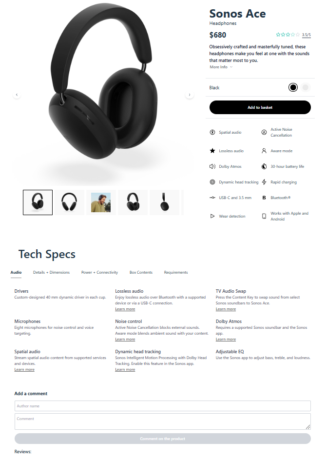

# Проект Product Cart

Цей репозиторій містить проект **Product Cart** — базову структуру для e-commerce платформи з продажу електротоварів.
Проект орієнтований на легкість підтримки та масштабування, що дозволяє адаптувати сторінку продукту під змінювані
потреби бізнесу та забезпечує зручний досвід користувача.

## Реалізований функціонал

- **Слайдер продукту**: Інтерактивний слайдер для перегляду зображень товару.
- **Мініатюри-індикатори**: Зображення мініатюр для швидкої навігації по слайдеру.
- **Перемикач кольору продукту**: Вибір доступних кольорів товару, що допомагає користувачу підібрати потрібний варіант.
- **Випадаючий список**: Детальний опис товару у вигляді списку, що зручно розгортається.
- **Таби для технічних характеристик**: Перемикання між розділами, що містять детальний опис технічних параметрів товару.
- **Блок коментарів**: Розділ для відгуків користувачів, який допомагає сформувати довіру до продукту.
- **Скролбар**: Зручний скролбар для навігації по контенту сторінки.

Проект **Product Cart** ідеально підходить для e-commerce рішень, орієнтованих на зручність та функціональність, зокрема
в сегменті електроніки.

<a href="https://karatsergio.github.io/Product-card/">Посилання на сторінку проєкту</a>

## Використані технології

Ось кілька ключових технологій, які використовуються у цьому проекті:

- react та react-dom: Основні бібліотеки для роботи з React.
- @radix-ui: Компоненти для створення інтерфейсів.
- tailwindcss: CSS фреймворк для швидкого стилізування.
- framer-motion: Бібліотека для анімацій.

**npm:**

- `npm run dev` — Запустити.
- `npm run build` — Збілдити.
- `npm run deploy` — Задеплоїти.
